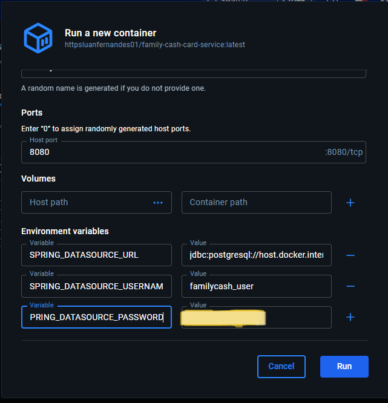
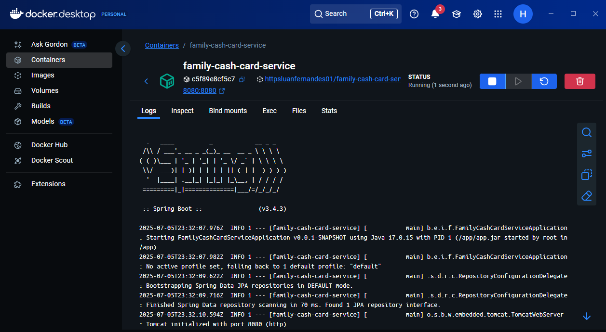
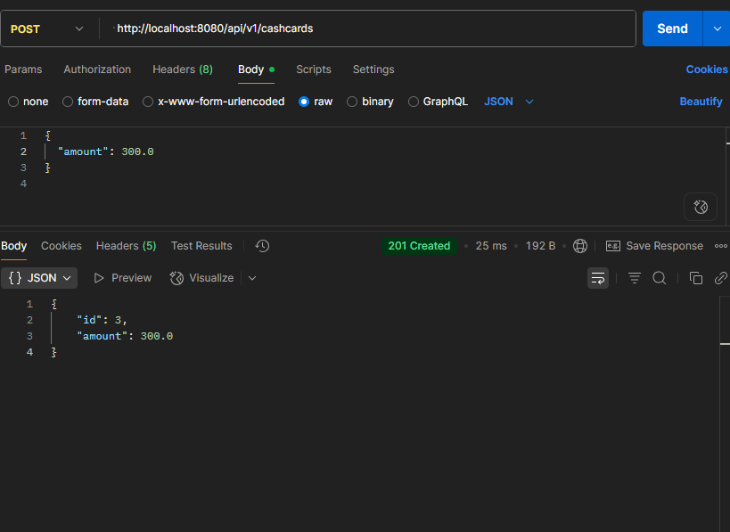
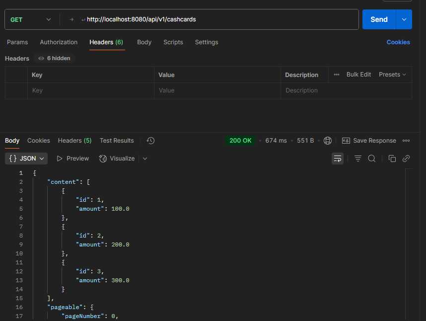
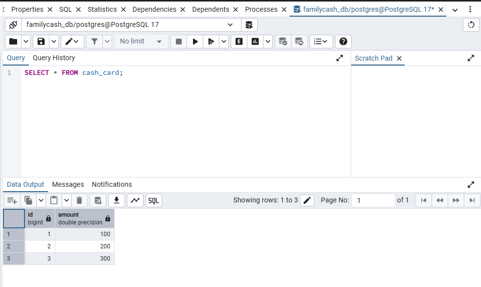

# Family Cash Card Service

Esta aplicação é uma API REST desenvolvida com Spring Boot. Ela utiliza um banco de dados externo, que deve ser configurado via variáveis de ambiente para que a aplicação possa se conectar corretamente ao banco.

---

## Variáveis de Ambiente para Conexão com Banco de Dados

Para que a aplicação consiga se conectar ao banco de dados externo, é necessário definir as seguintes variáveis de ambiente no ambiente onde o container Docker será executado:

| Variável                       | Descrição                                                     | Exemplo                                   |
| ------------------------------ | ------------------------------------------------------------- | ----------------------------------------- |
| `SPRING_DATASOURCE_URL`        | URL de conexão JDBC do banco de dados                         | `jdbc:postgresql://host:5432/db`          |
| `SPRING_DATASOURCE_USERNAME`   | Nome do usuário do banco de dados                             | `meu_usuario`                             |
| `SPRING_DATASOURCE_PASSWORD`   | Senha do usuário do banco de dados                            | `minha_senha`                             |

---

## Exemplo de configuração no Docker

Ao rodar o container Docker, você pode passar essas variáveis de ambiente assim:

```bash
docker run -d \
  -p 8080:8080 \
  -e SPRING_DATASOURCE_URL=jdbc:postgresql://meu-host-postgres:5432/minha-base \
  -e SPRING_DATASOURCE_USERNAME=usuario \
  -e SPRING_DATASOURCE_PASSWORD=senha \
  httpsluanfernandes01/family-cash-card-service:latest
```

---

## Considerações

* A URL JDBC varia conforme o banco utilizado. Para PostgreSQL, o formato é:

  ```
  jdbc:postgresql://<host>:<porta>/<nome-do-banco>
  ```
## Aplicação em Execução

### Variáveis de ambiente configuradas no Docker


### Container rodando no Docker Desktop


### Requisição POST no Postman para criar CashCard


### Requisição GET no Postman para listar CashCards


### Dados persistidos no banco de dados PostgreSQL


